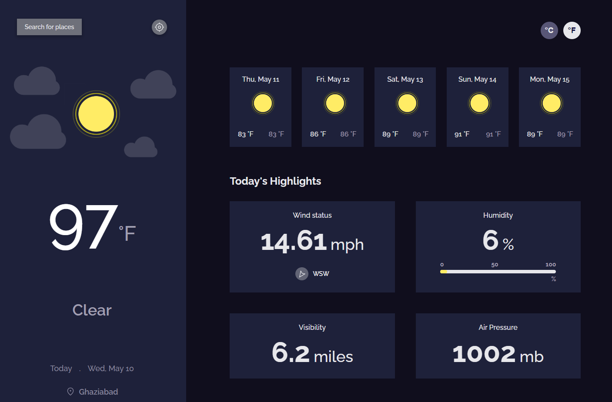
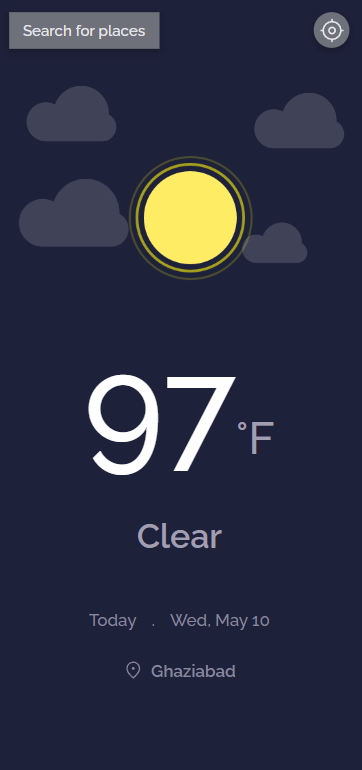

# WEATHER APP

This is a weather application that allows users to search for weather information of a specific location as well as retrieve the weather for their current location. The app is built using Vite, React, Sass, and utilizes the OpenWeather API. It also utilizes Zustand for state management and Axios for making API requests.

## Table of contents

-   [Overview](#overview)
    -   [Screenshot](#screenshot)
    -   [Links](#links)
-   [Features](#features)
-   [Technologies Used](#technologies-used)
-   [Installation](#installation)
-   [Usage](#usage)
-   [API Key](#api-key)
-   [Author](#author)

## Overview

The Weather App allows users to search for weather information by providing a specific location. It also provides the option to fetch the weather information for the user's current location based on their device's geolocation. The app displays relevant weather details such as temperature, humidity, wind speed, and weather conditions.

### Screenshot




### Links

-   Live Site URL: [https://weather-app-lake-omega.vercel.app/](https://weather-app-lake-omega.vercel.app/)

## Features

-   Search weather information by location
-   Fetch weather for the current location
-   Display temperature, humidity, wind speed, and weather conditions
-   Responsive design optimized for desktop, tablet, and mobile devices

### Technologies Used

-   Vite
-   React
-   SASS
-   OpenWeather API
-   Zustand (State Management)
-   Axios (HTTP Requests)

### Installation

To run this project locally, follow these steps:

1. Clone the repository:

```
git clone https://github.com/vishwa-akshat/weather-app.git

```

2. Navigate to the project directory:

```
cd weather-app

```

3. Install the dependencies using npm or yarn:

```
npm install
# or
yarn install

```

### Usage

To start the development server, run:

```
npm run dev
# or
yarn dev
```

This will start the app in development mode. Open your browser and navigate to http://localhost:3000 to see the app.

### API Key

In order to retrieve weather information, you will need to obtain an API key from the OpenWeather website. Once you have the API key, create a new file named .env in the project root directory and add the following line:

```
VITE_API_KEY=your_api_key

```

Replace your_api_key with your actual API key.

## Author

-   Website - [Akshat Vishwakarma](https://akshat-dev.vercel.app/)
-   Twitter - [@akshatVis](https://twitter.com/akshatVis)
